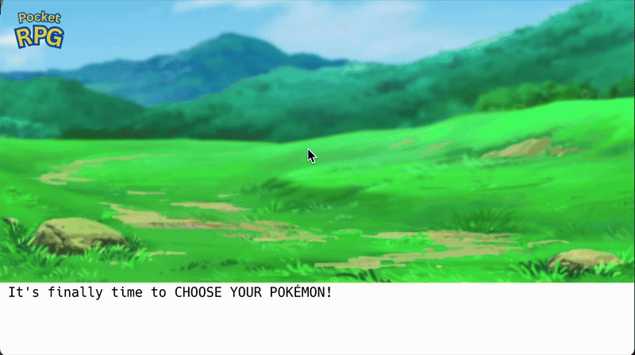

# 🎮  Pocket RPG
*A retro-style RPG heavily inspired by the world of Pokémon, built with Java*

---

## 📖 Preface
For my Grade 12 Computer Science class (**ICS4U1**), I was tasked with building an RPG game that leverages basic data manipulation through I/O and supports a spontaneous stream of input from users to create a smooth, dynamic, and immersive experience.  

Inspired by my interest in Pokémon, I took to building my own, small-scaled simulated version of the classical, fan-favourite Pokémon role-playing game — where the player can traverse a world, gain experience, encounter Pokémon, and face foes deployed by none other than **Team Rocket**.  

Pocket RPG was designed for educational purposes and is being showcased as a product of my learning journey and
the possibilities of elementary programming concepts and tools, sprinkled with a bit of creativity and passion!

Most of the Pokémon-replicated graphical elements were hand-made using **Pixilart**.

### ${}$

## ⚙️ Built With
- **Language:** Java  
- **Library:** [`arc.jar`](https://arc.teach.cs.utoronto.ca) — for console I/O and simple graphics  
- **IDE:** Visual Studio Code  
- **Assets:** Custom pixel art created with [Pixilart](https://www.pixilart.com)

### ${}$

## 🧩 Features
- Explore a simulated Pokémon world  
- Encounter wild Pokémon   
- Battle and (hopefully) defeat Team Rocket’s trainers  
- Gain XP and level up your Pokémon  
- Save and load game progress via file I/O  
- Custom-made pixel graphics displayed through the `arc` library

### ${}$
## 🚀 How to Run (Setup)

1. **Clone the repository:**
   ```bash
   git clone https://github.com/BoscoZhangers/PocketRPG.git
   ```

2. **Enter the Repo:**
   ```bash
   cd PocketRPG
   ```
   
3. **Ensure you have `arc.jar` in the project directory.**
   (it must be located in the same directory as `RPG.class`).
   
5. **Run: In `PocketRPG/`, run:**

   > **Mac Users:**
   > ```bash
   > java -cp .:arc.jar RPG
   > ```

   > **Windows Users:**
   > ```bash
   > java -cp .;arc.jar RPG
   > ```

### ${}$

## 🧱 File Structure 

```
PokemonRPG/
 │ 
 ├── RPG.class 
 ├── arc.jar
 │    
 ├── Data/
 │    ├── Data.txt
 │    ├── Hold.txt
 │    ├── Level1.csv
 │    ├── Level2.csv
 │    └── Level3.csv
 │ 
 ├── Images_Pokemon_RPG/
 │   └── Terrain/
 │       ├── Grass1.png
 │       ├── Grass2.png
 │       ├── HealBL.png
 │       ├── HealBR.png
 │       ├── HealTL.png
 │       ├── HealTR.png
 │       ├── MountainBR.png
 │       ├── Tree.png
 │       └── Water.png
 │   └── Enemies/
 │       ├── RocketTrainer.png
 │       ├── James.png
 │       ├── Jessie.png
 │       └── Zubat.png
 │
 │   ├── BattleGUI.png
 │   ├── Chansey.png
 │   ├── ChanseySelect.png
 │   ├── Eevee.png
 │   ├── EeveeSelect.png
 │   ├── Pikachu.png
 │   ├── PikachuSelect.png
 │   ├── BattleGUI.png
 │   ├── IntroGUI.png
 │   ├── GUI1.png
 │   ├── GUI2.png
 │   ├── GUI3.png
 │   ├── GUI4.png
 │   ├── HelpGUI.png
 │   ├── HomeNavGUI.png
 │   ├── Pokeball.png
 │   ├── Play.png
 │   └── PlayMapGUI.png
 │ 
 └── README.md
```

### ${}$

## 🎮 How to Play

#### 1) Login / Sign-Up 🔐
   To create a new account, simply follow the prompt and enter the username (which you will then use to log in moving forward).
   Your account (and its info) will be stored in your repo directory, in data.txt. If you already have an account saved in data.txt, use the same username to log in.


 
### ${}$

#### 2) Select Your Pokémon ‼️
   Newly registered accounts will be given 3 choices for their first pokémon! Each pokémon comes with a special starting advantage. 


### ${}$

### 3) Navigate the Main Menu 🏠
   At any time, you can return to your personalized main menu where you can either start/resume your game using the escape key (esc), save your progress, find help, or quit.
   Your stats, including your level and attack damage will also be displayed here! Once you're ready, press (p) to start your adventure!

### 4) Select Level / Route 🚪
   You'll be prompted to select your route/level. To the rookies, you'll want to start at route 1 and eventually work your way up to route 9 and route 22, 
   subject to level limitations, for your own safety!

### 5) Controls 🎮
* `W` / `up-arrow` to move up
* `d` / `down-arrow` to move down
* `s` / `right-arrow` to move right
* `a` / `left-arrow` to move left
* `esc` to return to main menu

### 6) Combat ⚔️
As you traverse the world, you may find yourself engaged in combat with wild pokemon or some foes from Team Rocket. When players are locked in combat, all movement controls are disabled until the player defeats the enemy or is defeated.

Combat is facilitated in a "rock-paper-scizzors" fashion whereby the player initiates one of the following moves with their pokémon companion:
-  (1) Attack
-  (2)

### ${}$

## 🧠 Design Notes


### ${}$

## ✨ Credits
* **Developer:** Bosco Zhang
* **Course:** ICS 4U1 (Grade 12 Computer Science)
* **Instructor:** Alfred Ron Cadawas
* **Art Assets:** 
* **Framework:** ARC Java Library (for console graphics and sound)
* **Graphic Design and Overall Inspiration:** Nintendo and the Pokémon Company

### ${}$

## 💬 Feedback 
All feedback, whether, commentative or suggestive, are welcome. If you experience any bugs or have any suggestions on improvement, feel free to reach out to me at Boscozhang715@gmail.com! We are always looking for ways to learn and improve! :)

### ${}$

## 📜 License

This project was developed for educational purposes and is not affiliated with or endorsed by Nintendo, Game Freak, or The Pokémon Company. This project is not to be commercialized or redistributed in any way, should anybody do otherwise, they accept any and all legal liability. 
